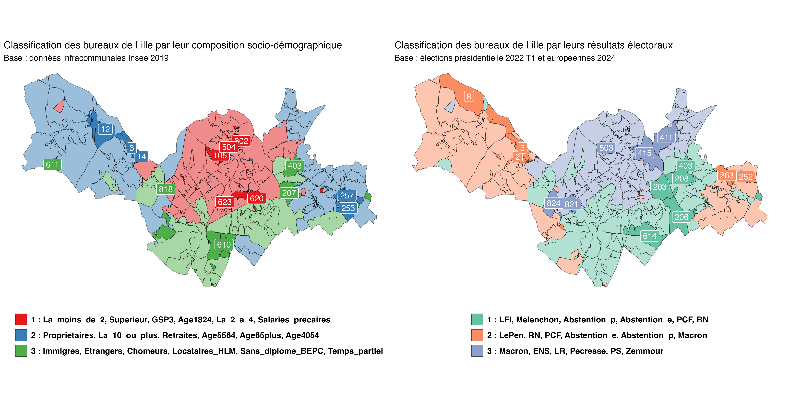
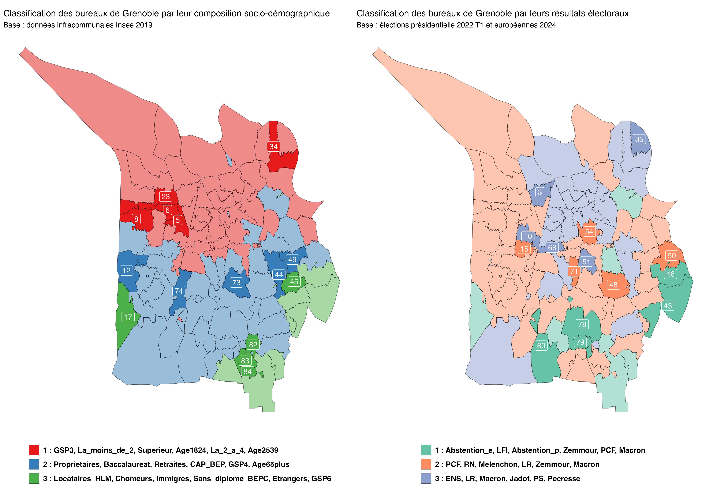
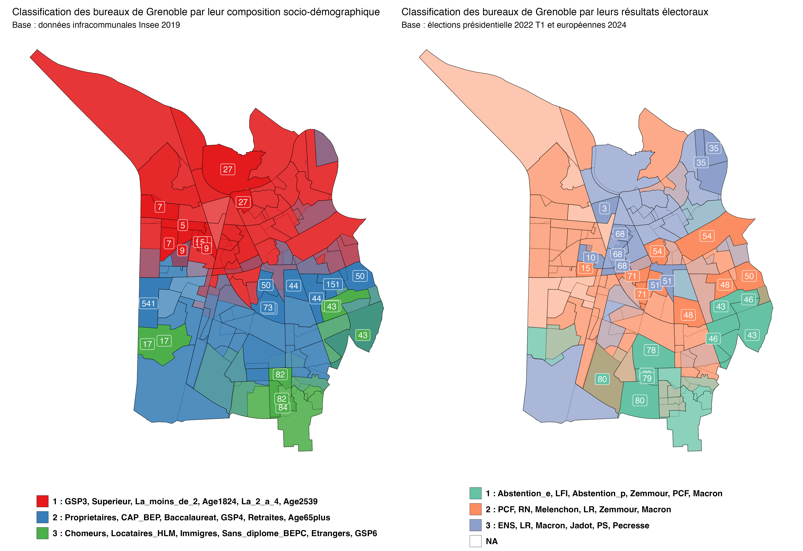

## HOWTO

1. Run `1-telechargement-donnees.r` to save all required datasets to `donnees`.
2. Run `2-preparation-donnees.r` to process all datasets.
3. Run `3-selection-bureaux.r` to get the _bureaux_ classified.

Processed datasets and final results will be saved into `sorties`, including a summary map of the top 5 representative clusters in each class:




Both maps above use [Voronoi-based polygons](https://blog.insee.fr/a-vote-a-chaque-bureau-de-vote-ses-electeurs/) to plot the _bureaux de vote_, but since the city of Grenoble releases [official shapefiles](https://data.metropolegrenoble.fr/visualisation/information/?id=les-bureaux-de-vote) for these, let's use that instead:

```r
sf::st_read("decoupage_bureau_vote_epsg4326/") %>% 
  dplyr::mutate(numeroBureauVote = str_pad(dec_bure_1, width = 4, 
                                    side = "left", pad = "0"),
                codeBureauVote = str_c("38185", numeroBureauVote, sep = "_")) %>% 
  readr::write_rds("sorties/contours-Grenoble-BV-2025.rds")
```

Let's now run scripts 2 and 3 with `code_insee_cible` set to `"38185"`, `nom_fichier_base` set to `"Grenoble"`, and map height set to `12`:



The alpha and fill overlays say something of the instability of the _bureaux de vote_, some of which were suppressed in recent years ([details](https://github.com/briatte/selection-bv/issues/1)). The scripts cannot make up for that and will only throw some warnings if they detect related issues.

## Changes to Tristan's code

Mostly notes to self:

- automated all required data downloads
- automated all package installs
- updated [`spReapportion`][spReapportion] to [`sfReapportion`][sfReapportion]
- most data saved in, and read from, zipped archives, to save disk space
- code rewritten in order to allow easier re-use with other cities
- edited column selection within Insee files to avoid a few duplicates
- corrected a typo that created very slightly incorrect results (_bureau_ 901)
- visualization of the final results

The code has a few less package dependencies (although it does import the entire [`tidyverse`][tidyverse], so there's that), and works without having to install some retired packages that were required by [`spReapportion`][spReapportion]. It also downloads slightly less data from Insee.

[spReapportion]: https://github.com/joelgombin/spReapportion
[sfReapportion]: https://github.com/briatte/sfReapportion
[tidyverse]: https://tidyverse.org/

## Data sources

- Etalab, [Proposition de contours des bureaux de vote][contours-bv], 2023
  - see [this blog post][contours-bv-insee]
  - see also the [`mapvotr`][mapvotr] package
- IGN/Insee, [Contours... IRIS®][contours-iris], 2019
- Insee, Recensement de la population - Base infracommunale (IRIS), 2019
  - [Activité des résidents][actifs]
  - [Population][population]
  - [Diplômes - Formation][diplome-formation]
  - [Logement][logement]
  <!-- - [Couples - Familles - Ménages][menages] -->
- Ministère de l'Intérieur, [Résultats des élections européennes du 9 juin 2024][eur24]
- Ministère de l'Intérieur, [Election présidentielle des 10 et 24 avril 2022 - Résultats définitifs du 1er tour][prt122]

[contours-bv]: https://www.data.gouv.fr/datasets/proposition-de-contours-des-bureaux-de-vote/
[contours-bv-insee]: https://blog.insee.fr/a-vote-a-chaque-bureau-de-vote-ses-electeurs/
[mapvotr]: https://inseefrlab.github.io/mapvotr/
[contours-iris]: https://geoservices.ign.fr/contoursiris
[actifs]: https://www.insee.fr/fr/statistiques/6543289
[population]: https://www.insee.fr/fr/statistiques/6543200
[diplome-formation]: https://www.insee.fr/fr/statistiques/6543298
[logement]: https://www.insee.fr/fr/statistiques/6543302
<!-- [menages]: https://www.insee.fr/fr/statistiques/6543224 -->
[eur24]: https://www.data.gouv.fr/datasets/resultats-des-elections-europeennes-du-9-juin-2024
[prt122]: https://www.data.gouv.fr/datasets/election-presidentielle-des-10-et-24-avril-2022-resultats-definitifs-du-1er-tour

## Package dependencies

All available from CRAN unless noted otherwise:

- `archive` (to deal with `.7z`)
- `factoextra`
- `FactoMineR` (for [PCA][pca] and [HCPC][hcpc])
- `patchwork`
- `remotes` (to install [`sfReapportion`][sfReapportion] from GitHub)
- `sf`
- [`sfReapportion`][sfReapportion] (only available on GitHub)
- `tidyverse`

[pca]: http://factominer.free.fr/factomethods/analyse-en-composantes-principales.html
[hcpc]: http://factominer.free.fr/factomethods/classification-hierarchique-sur-composantes-principales.html

## Questions

Reach me at `f.briatte at gmail dot com` if need be, or [open an issue](https://github.com/briatte/selection-bv/issues) (English or French).
